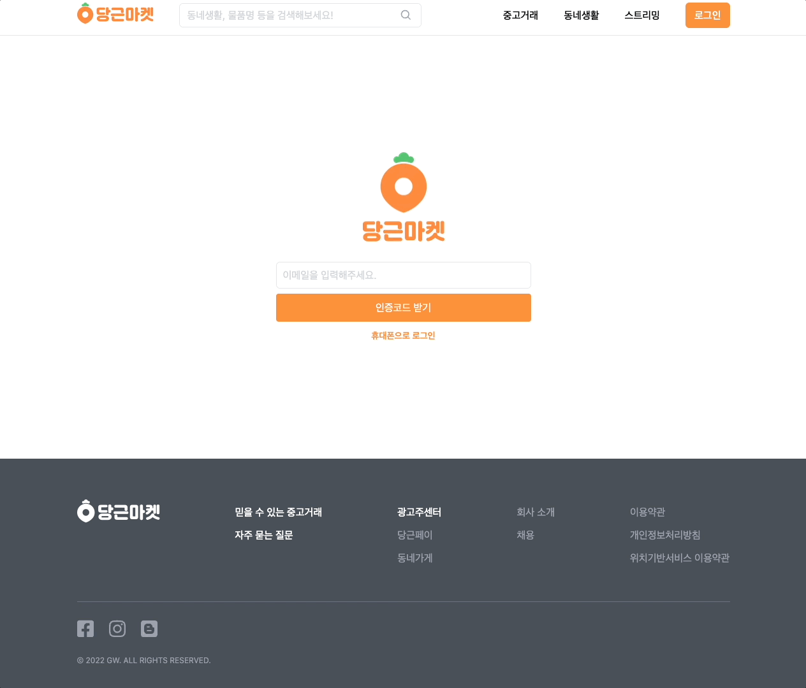
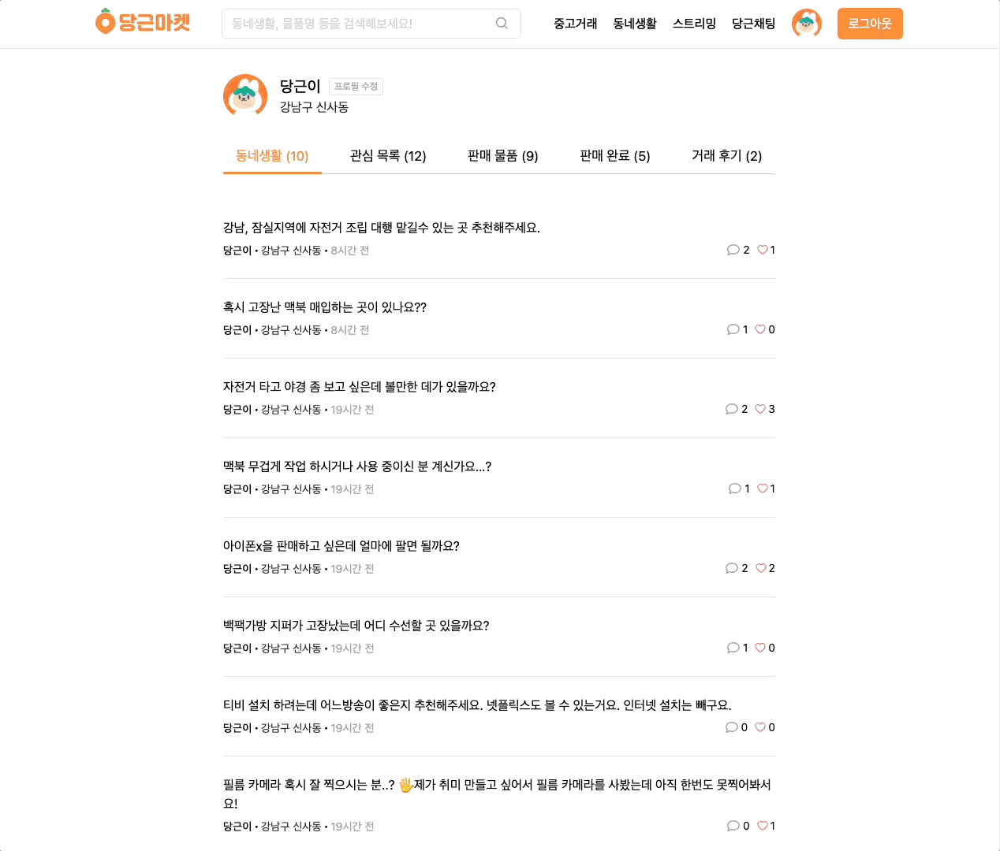
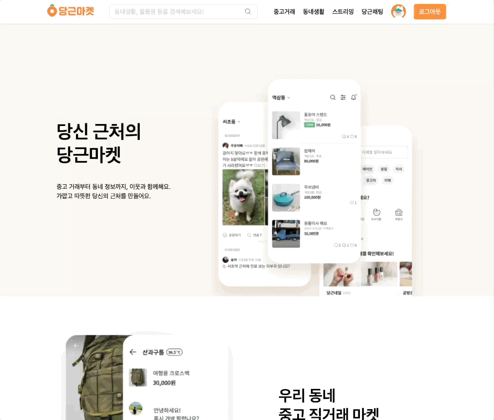
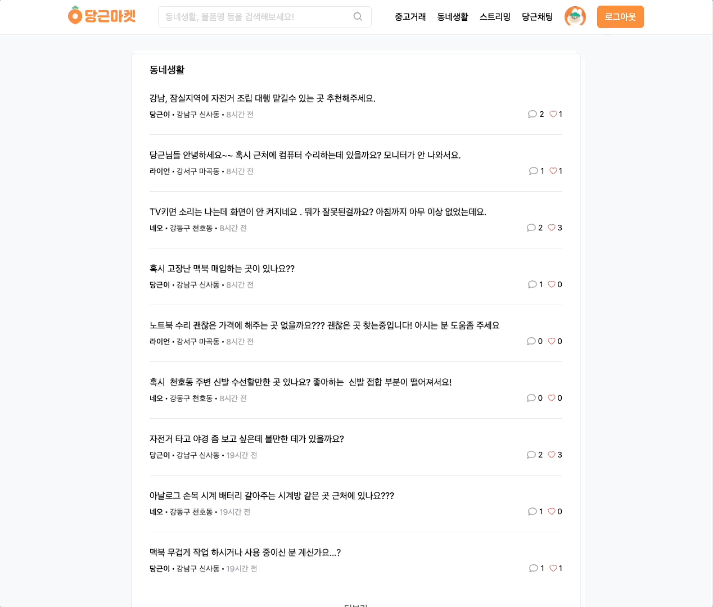
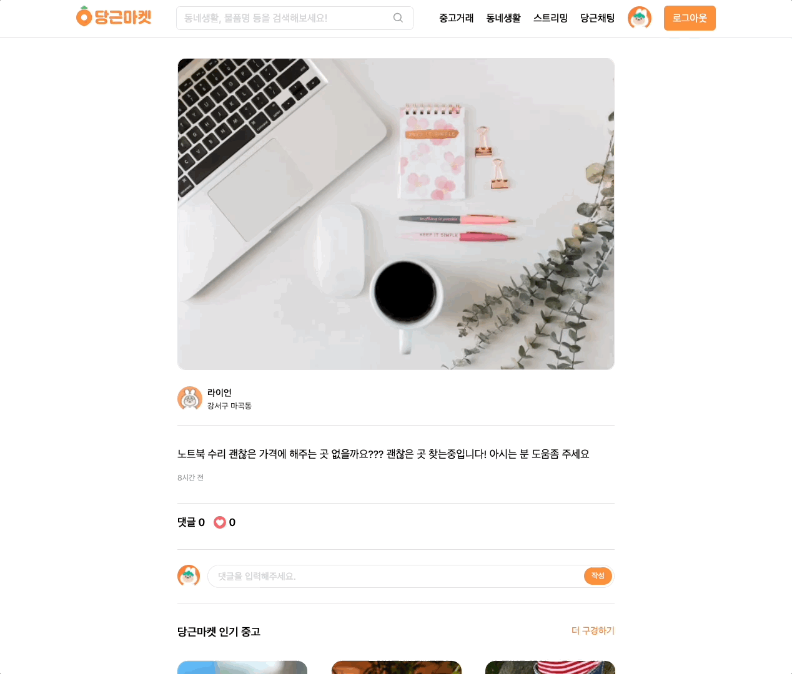
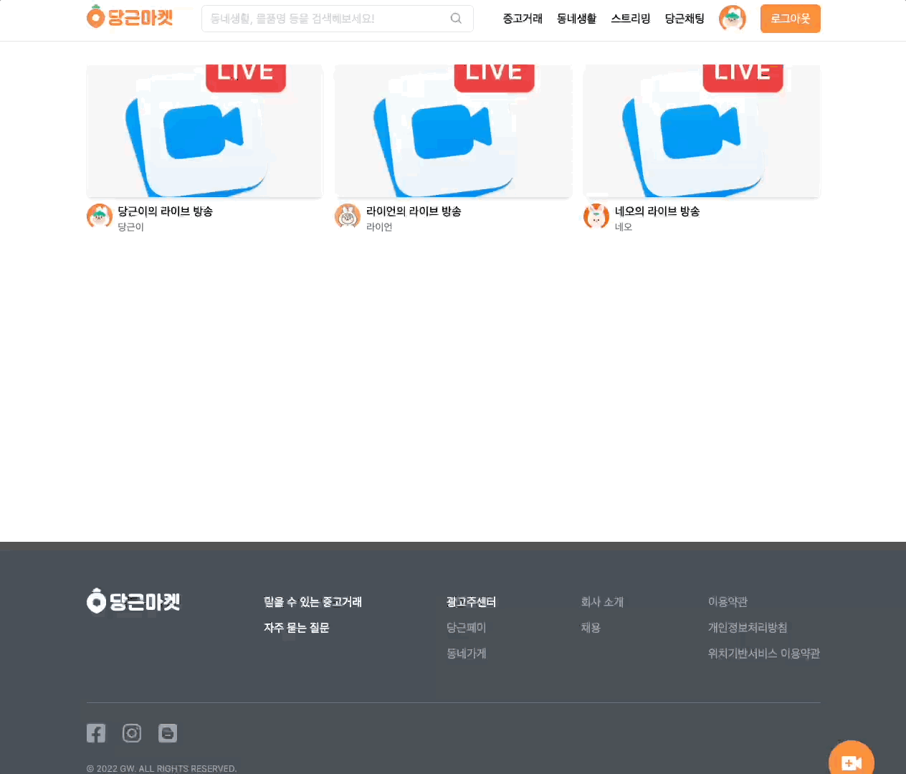
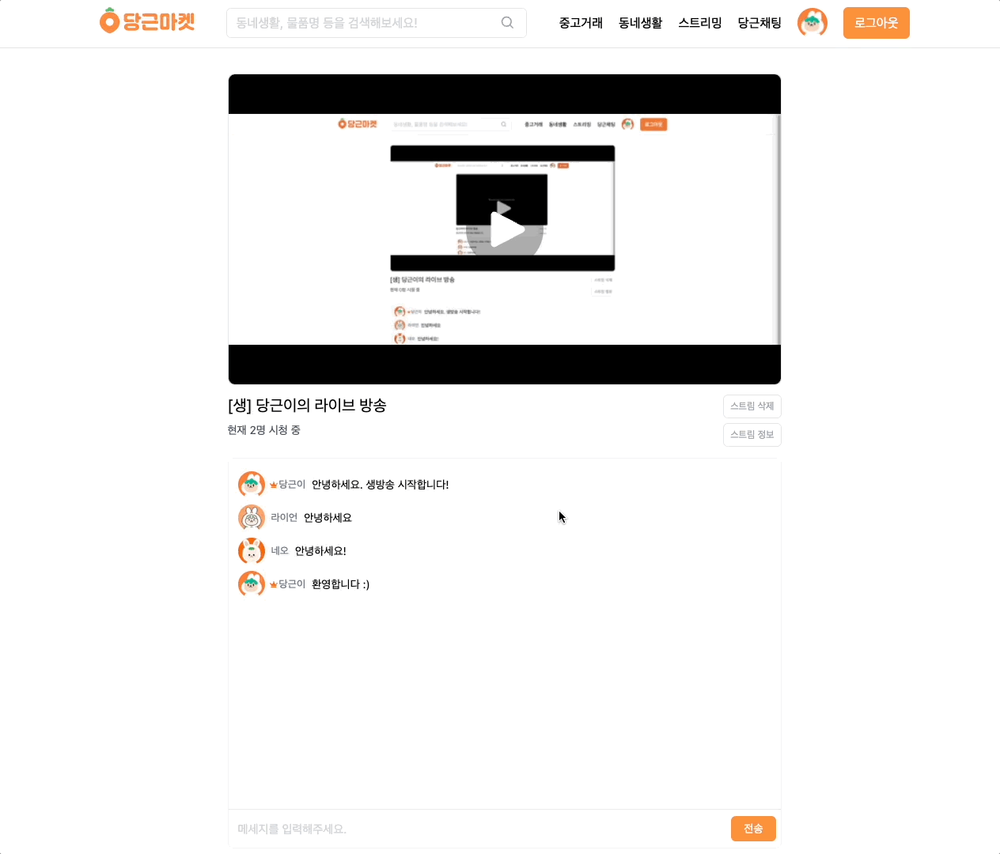
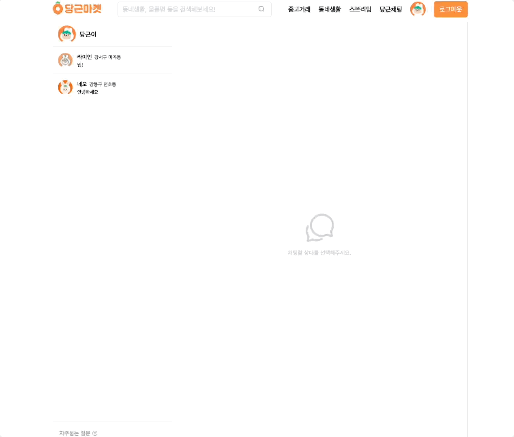
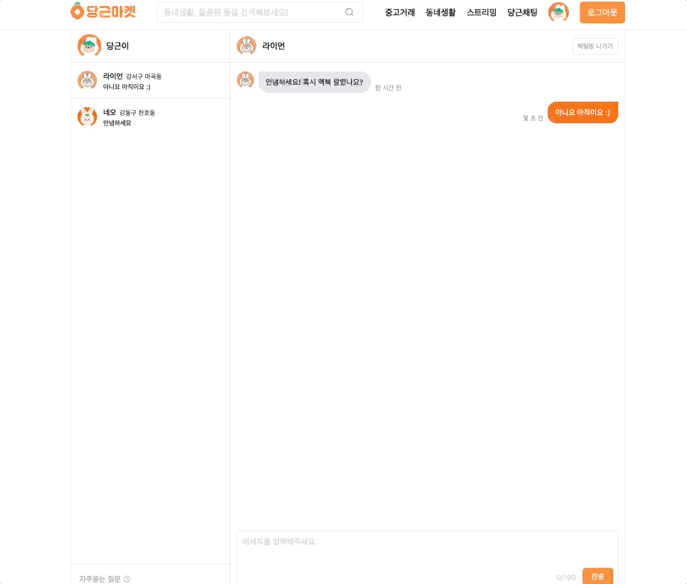

  <a href="https://danggeun-market.vercel.app">
    
      
    <a display="block" href="https://danggeun-market.vercel.app">https://danggeun-market.vercel.app</a>
      
    
  </a>

## Table of contents

- 🔥 [Built with](#built-with)
- 🌈 [Project](#project)
- 📑 [Pages](#pages)
- ⚙ [Features](#features)
- 📝 [License](#license)

## Built with

### Front-end

- `NextJS`
- `React`
- `Typescript`
- `SWR`
- `TailwindCSS`

### Back-end

- `PlanetScale`
- `Prisma`
- `Twilio`
- `SendGrid`
- `Iron Session`
- `Cloudflare Images`
- `Cloudflare Stream`

### Deploy

- `Vercel`
- `PlanetScale`
- `Cloudflare`

## Project

> 1. 로그인

- 유저는 사용 중인 이메일 또는 휴대폰을 이용해 인증코드를 받고, 인증코드를 통해 로그인할 수 있습니다.
- 이메일 로그인 시, `Twilio SendGrid Email API`를 이용해 이메일에 인증코드를 전송합니다.
- 휴대폰 로그인 시, `Twilio Messaging Service`를 이용해 휴대폰에 인증코드를 전송합니다.
- 인증코드를 통해 성공적으로 로그인 시, `Iron Session`을 이용해 세션 데이터를 암호화된 쿠키에 저장합니다.
- 암호화된 쿠키에 저장된 세션 데이터는 오직 서버측에서만 복호화할 수 있습니다.
    
  

> 2. 프로필

- 프로필 페이지에서 유저의 정보를 확인하거나, 유저의 프로필 사진, 이름, 이메일, 휴대폰 번호를 변경할 수 있습니다.
- 동네 생활, 관심 목록 탭에서 작성한 포스트를 확인하거나 관심 상품 및 게시물을 확인할 수 있습니다.
- 판매 물품, 판매 완료 탭에서 판매 중이거나 판매를 완료한 상품을 확인할 수 있습니다.
- 거래 후기 탭에서 상대방이 작성한 리뷰를 확인하거나 상대방에게 평점과 함께 리뷰를 남길 수 있습니다.
    
  

> 3. 상품 및 포스트 검색

- 상품 이름으로 상품을 검색할 수 있습니다.
- 포스트 내용으로 포스트를 검색할 수 있습니다.
    
  

> 4. 상품

- 중고거래 페이지에서 등록된 전체 상품을 확인할 수 있습니다.
- 더 보기를 클릭해 추가적으로 상품들을 불러올 수 있습니다.
- 등록된 상품을 클릭해 상품 상세정보를 확인할 수 있습니다.
- 상품 업로드 페이지에서 상품 이미지, 이름, 가격, 설명을 입력한 후, 새로운 상품을 업로드할 수 있습니다.
- 첨부한 이미지는 `Cloudflare Images`에 최적화되어 저장됩니다.
    
  

> 5. 상품 상세정보

- 상품 상세정보 페이지에서 상품 이미지, 이름, 가격, 설명, 관심 수를 확인할 수 있습니다.
- 상품에 좋아요를 눌러 유저의 관심 목록에 추가하고, `SWR`을 이용해 캐시를 업데이트합니다.
- 채팅으로 거래하기를 클릭해 상품 판매자와 채팅을 할 수 있습니다.
- 상품 판매자는 거래 완료 시, 판매 완료를 눌러 상품 판매를 완료할 수 있습니다.
- 상품 이름과 비슷한 이름의 상품들을 관련 상품들에서 확인할 수 있습니다.
    
  

> 6. 포스트

- 동네 생활 페이지에서 작성된 전체 포스트를 확인할 수 있습니다.
- 더 보기를 클릭해 추가적으로 포스트들을 불러올 수 있습니다.
- 작성된 포스트를 클릭해 포스트 상세정보를 확인할 수 있습니다.
- 포스트 작성 페이지에서 포스트 이미지, 설명을 입력한 후, 새로운 포스트를 작성할 수 있습니다.
- 첨부한 이미지는 `Cloudflare Images`에 최적화되어 저장됩니다.
    
  

> 7. 포스트 상세정보

- 포스트 상세정보 페이지에서 포스트 이미지, 설명, 댓글, 좋아요 수를 확인할 수 있습니다.
- 포스트에 좋아요를 눌러 유저의 관심 목록에 추가하고, `SWR`을 이용해 캐시를 업데이트합니다.
- 포스트에 댓글을 작성하고 삭제할 수 있습니다.
    
  

> 8. 스트리밍

- 스트리밍 페이지에서 전체 스트리밍을 확인할 수 있습니다.
- 스트리밍을 클릭해 스트리밍 상세정보를 확인할 수 있습니다.
- 스트리밍 생성 페이지에서 스트리밍 제목, 내용을 입력한 후, 새로운 스트리밍을 생성할 수 있습니다.
    
  

> 9. 스트리밍 상세정보

- 스트리밍 상세정보 페이지에서는 현재 방송 중인 실시간 스트리밍 또는 스트리머의 최신 방송을 시청할 수 있습니다.
- 스트리머는 `Cloudflare Stream`에서 제공하는 서버 URL과 스트림 키를 이용해 실시간 스트리밍을 시작할 수 있습니다.
- 실시간 스트리밍 방송에서는 시청자 수를 확인할 수 있고, 채팅을 통해 다른 여러 유저들과 대화할 수 있습니다.
- 스트리밍 종료 시, 녹화된 비디오는 저장되어 최신 방송에서 다시 시청할 수 있습니다.
    
  

> 10. 채팅

- 채팅 페이지에서 전체 채팅을 확인할 수 있습니다.
- 채팅을 클릭해 채팅 상세정보를 확인할 수 있습니다.
    
  

> 11. 채팅 상세정보

- 채팅 상세정보 페이지에서는 상품 판매자와 대화할 수 있습니다.
- 상품 판매자와의 거래가 끝났다면 채팅방 나가기를 통해 채팅을 종료할 수 있습니다.
    
  

## Pages

> Root

- 홈
- 로그인
- 검색

> User

- 동네 생활
- 관심 목록
- 판매 물품
- 판매 완료
- 거래 후기
- 프로필 수정

> Product

- 전체 상품
- 상품 상세정보

> Post

- 전체 포스트
- 포스트 상세정보

> Stream

- 전체 스트리밍
- 스트리밍 상세정보

> Chat

- 전체 채팅
- 채팅 상세정보

## Features

### 🙎‍♂️ User

- [x] 이메일, 휴대폰 로그인
- [x] 로그아웃
- [x] 프로필 보기
- [x] 아바타 업로드
- [x] 프로필 수정
- [x] 리뷰 작성
- [x] 리뷰 삭제

### 📦 Product

- [x] 전체 상품 보기
- [x] 상품 상세정보 보기
- [x] 상품 업로드
- [x] 상품 삭제
- [x] 상품 좋아요
- [x] 상품 검색
- [x] 상품 판매완료
- [x] 상품 판매자와 채팅

### 📋 Post

- [x] 전체 포스트 보기
- [x] 포스트 상세정보 보기
- [x] 포스트 작성
- [x] 포스트 삭제
- [x] 포스트 좋아요
- [x] 포스트 검색
- [x] 포스트 댓글

### 🎥 Stream

- [x] 전체 스트리밍 보기
- [x] 스트리밍 상세정보 보기
- [x] 스트리밍 생성
- [x] 스트리밍 삭제
- [x] 스트리밍 채팅

### 💬 Chat

- [x] 전체 채팅 보기
- [x] 채팅 상세정보 보기
- [x] 채팅 생성
- [x] 채팅 삭제

## License

<a>MIT</a>
